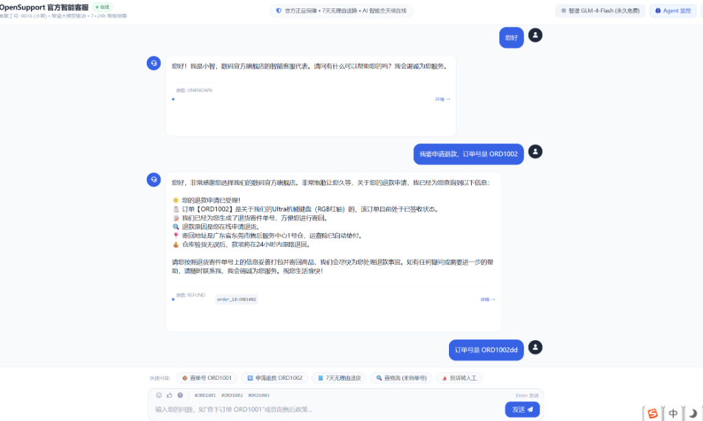
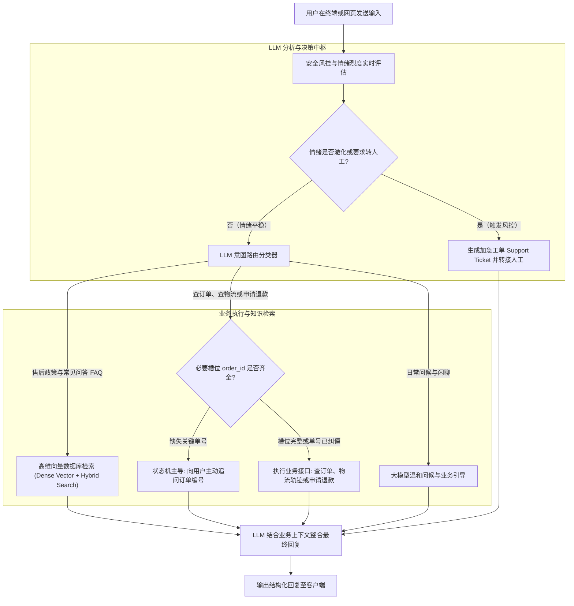

<div align="center">

# 🎧 OpenSupport

### 基于大语言模型 (LLM) 的现代化智能客服 Agent 框架
*A Production-Ready LLM-Powered Customer Service Agent Framework with Dynamic Intent Routing, Stateful Slot Filling, Vector RAG & Tool Orchestration.*

[](https://opensource.org/licenses/MIT)
[](https://www.python.org/downloads/)
[](https://fastapi.tiangolo.com)
[](#-向量检索与知识库集成)
[%20%7C%20DeepSeek%20%7C%20Ollama%20%7C%20Mock-success.svg)](#1-大语言模型-llm-集成)

[项目概述](#-项目概述) | [界面样例](#-界面效果样例) | [核心架构](#-基于-llm-的智能客服架构) | [支持的配置与集成](#-支持的配置与集成) | [运行与配置指南](#-运行与配置指南) | [English](#-english-overview)

</div>

---

## 📸 界面效果样例

OpenSupport 采用极简全屏经典即时通讯设计，同时兼顾开发者与业务运营人员的监控诉求，原生集成 Agent 决策实时洞察能力：

<div align="center">



*图：OpenSupport 经典全屏对话窗口与多轮业务办理演示（包含意图分类、槽位自动填充 `order_id`、订单物流详情调取与结构化退款受理）*

</div>

### 界面设计亮点：
* **全屏极简聊天流**：居中舒适阅读宽度，消除杂乱侧边干扰，还原经典 IM 聊天质感。
* **状态感知顶栏**：动态显示当前连接的服务商与大模型（如 `智谱 GLM-4-Flash 永久免费`）、在线客服状态以及 **Agent 监控抽屉入口**。
* **业务卡片与微交互**：对工具执行返回的订单明细、顺丰/京东快递轨迹、退款指引采用易读格式排版，并标注意图标签与填充槽位。
* **快捷提问浮岛与工具栏**：支持一键发送常用测试指令（查单号、办退款、问售后、查物流、转人工），提供沉浸式体验。

---

## 💡 项目概述

在传统智能客服中，规则库匹配往往过于死板，而简单的“大模型 Prompt 套壳”又容易在真实复杂业务中产生**幻觉、乱调用工具、无法多轮追问缺失参数**等严重缺陷。

**OpenSupport 是专为解决生产环境复杂业务设计的 LLM 智能客服 Agent 框架。**  
它将大语言模型强大的**自然语言理解与推理能力**，与确定性的**业务状态机、高维向量数据库检索、电商业务工具链、情绪风控转人工**进行深度协同：

1. **LLM 意图驱动分流**：利用大模型语义理解，精准识别用户意图（政策问答 FAQ、业务查询办理、闲聊问候、投诉转人工），实现精准业务分流。
2. **状态机主动填槽 (Slot Filling)**：当用户意图明确但关键参数缺失时（例如仅发送“查物流”而未给单号），框架主动发起温和追问，补齐必填项后再调度底层工具。
3. **高维向量数据库检索 (Vector RAG)**：结合稠密高维向量近邻检索（余弦相似度）与关键词匹配，解决用户用词多样性问题，确保政策解答权威、真实且无幻觉。
4. **确定性业务工具编排**：由大模型根据对话上下文自动提取参数，安全调用订单查询、物流轨迹追踪、退货退款等业务接口。
5. **动态情绪风控与人工兜底**：实时量化用户愤怒情绪分值（1-5 分），遇到激烈投诉或扬言投诉消协时，触发紧急情绪安抚并自动生成结构化支持工单转接人工。

---

## 🏗️ 基于 LLM 的智能客服架构



---

## 🔌 支持的配置与集成

OpenSupport 采用高度模块化解耦设计，支持丰富的模型供应商、向量检索引擎与企业业务系统集成：

### 1. 大语言模型 (LLM) 集成

框架内置通用 OpenAI 协议适配层，支持根据环境变量自动发现并热切换最适合的模型供应商：

| 模型方案 | 环境变量配置 | 特点与适用场景 |
| :--- | :--- | :--- |
| **智谱 AI (GLM-4-Flash)** | `ZHIPU_API_KEY=...` | **官方永久免费调用**，极速响应（<200ms），商用免成本首选（推荐）。 |
| **DeepSeek 官方 API** | `DEEPSEEK_API_KEY=...` | 极高性价比与出色长文本推理能力，支持 `deepseek-chat`。 |
| **硅基流动 (SiliconFlow)** | `SILICONFLOW_API_KEY=...` | 提供官方 0 元免费的 `DeepSeek-R1-Distill-Qwen-7B`。 |
| **OpenRouter** | `OPENROUTER_API_KEY=...` | 海外多模型聚合平台，支持免费模型标签 `deepseek/deepseek-r1:free`。 |
| **OpenAI 官方** | `OPENAI_API_KEY=...` | 兼容 `gpt-4o`、`gpt-4o-mini` 标准接口。 |
| **本地私有化 Ollama** | 本地运行 `ollama run qwen2.5:7b` | **完全本地离线、零外网依赖、企业私有化部署**，自动探测 `11434` 端口。 |
| **内置离线 Mock 仿真引擎** | 无需任何 Key 与网络 | 零门槛体验与脱机开发测试，100% 完整复现槽位流转与业务调用。 |

### 2. 向量检索与知识库集成 (Vector RAG)

为解决专业售后文档与海量政策问答检索，框架实现了基于高维稠密向量与稀疏关键词的**双路混合检索（Hybrid RAG）**：

* **Embedding 模型集成**：
  - 优先调用智谱 AI `embedding-3` 高维嵌入模型（2048 维向量）或 OpenAI `text-embedding-3-small`（1536 维）。
  - **离线语义降级引擎**：无 API 密钥时自动启用内置的双字 N-Gram 局部敏感语义哈希（384 维向量），保障 100% 可用性。
* **本地高性能向量数据库 (`VectorStore`)**：
  - 基于 NumPy 矩阵批量点积计算 L2 归一化向量的**余弦相似度（Cosine Similarity）**，毫秒级近邻排查。
  - 支持将向量索引及元数据持久化存储为本地文件（`data/vector_index.json`），免搭建复杂数据库集群。
  - **自适应索引校验**：当切换不同 Embedding 维度时，系统自动识别并重新生成索引，彻底规避矩阵维度不匹配异常。
* **工业级混合检索公式**：
  $$\text{Score} = \alpha \cdot \text{DenseScore} + (1 - \alpha) \cdot \text{SparseScore}$$
  兼顾语义泛化召回与专有名词字面匹配。

### 3. 业务系统与工具链集成 (Business Toolchain)

内置模拟电商中台与 ERP 系统，所有工具均具备标准输入验证与边界安全保护：

* **订单中心集成 (`query_order`)**：支持按订单号（如 `ORD1001`）调取下单时间、商品名、规格、实付金额与收货地址。
* **物流追踪系统 (`track_shipping`)**：返回承运快递公司（顺丰速运、京东快递）、运单号与多节点时序流转轨迹。
* **售后退款系统 (`apply_refund`)**：根据已签收或运输中状态，自动核验资格、生成退货寄件单、分摊退货运费并反馈退款原路返回时效。
* **地址变更系统 (`change_address`)**：支持用户在未发货前修改收件人与详细配送地址。

### 4. 人工客服与工单系统集成 (Human Escalation)

* **情感烈度量化**：多维度检测文本中的负面词汇、感叹语气、监管机构投诉（如“12315”、“消费者协会”、“曝光”）。
* **自动化工单生成**：自动抽取会话上下文、客户诉求、情绪分值并生成具备唯一 UUID 的结构化 `SupportTicket`。
* **企业级扩展通道**：支持将工单推送到企微机器人、钉钉告警、Jira Service Management 或 Zendesk。

### 5. Web 控制台与 REST API 集成

* **FastAPI 高性能驱动**：提供标准异步接口（`/api/chat`、`/api/session`、`/api/info`）。
* **全屏极简 WebUI**：集成侧边 Agent 决策监控抽屉（实时显示意图、情绪表盘、槽位字典、工单历史）。

---

## 🛠️ 运行与配置指南

### 第 1 步：克隆代码与安装运行环境

推荐使用 **Python 3.10 或更高版本**：

```bash
# 1. 克隆代码仓库
git clone https://github.com/guan110110/OpenSupport.git
cd OpenSupport

# 2. 安装 Python 依赖
pip install -r requirements.txt
```

### 第 2 步：环境变量配置 (`.env`)

在项目根目录下创建 `.env` 文件（或直接复制模板 `copy .env.example .env`）：

```ini
# ========================================================
# 方案 A: 智谱清言 (推荐! 官方 GLM-4-Flash 永久免费，极速稳定)
# 获取地址: https://bigmodel.cn/
# ========================================================
ZHIPU_API_KEY=your_zhipu_api_key_here

# ========================================================
# 方案 B: DeepSeek 官方 API
# 获取地址: https://platform.deepseek.com/
# ========================================================
# DEEPSEEK_API_KEY=your_deepseek_api_key_here

# ========================================================
# 方案 C: 硅基流动 SiliconFlow (0元免费体验 DeepSeek-R1-7B)
# ========================================================
# SILICONFLOW_API_KEY=your_siliconflow_key_here

# ========================================================
# 方案 D: 本地 Ollama (完全离线免费)
# 无需配置 Key，只需在本地运行: ollama run qwen2.5:7b
# ========================================================
```

> 💡 **零配置提示**：若未配置任何 API Key 且未启动 Ollama，系统会自动无缝启用**内置 Mock 仿真引擎**，所有槽位追问、工具调用和状态流转均可 100% 完整体验！

### 第 3 步：启动与运行

框架支持三种灵活的运行方式：

#### 方式 A：启动全屏 Web 工作台（最推荐）

```bash
python webui/server.py
```
* 服务启动后将自动唤起系统默认浏览器访问 **`http://127.0.0.1:8501`**。
* 您可以畅享全屏经典即时通讯界面，并可点击右上角 **“Agent 监控”** 展开侧边抽屉观测内部决策。

#### 方式 B：启动终端交互式对话 (CLI)

适合开发者在 Linux 服务器或无图形界面终端调试：

```bash
python examples/cli_chat.py
```

#### 方式 C：部署为后台微服务 (Uvicorn)

```bash
uvicorn webui.server:app --host 0.0.0.0 --port 8501 --workers 2
```

### 第 4 步：自动化测试验证

项目中提供了完整的单元测试与集成测试，覆盖槽位填充、情绪风控、订单纠偏与向量检索：

```bash
python -m pytest tests/ -v
```

执行结果验证：
```text
tests/test_service.py::test_faq_question PASSED                          [ 11%]
tests/test_service.py::test_order_query_slot_filling PASSED              [ 22%]
tests/test_service.py::test_human_escalation_on_anger PASSED             [ 33%]
tests/test_service.py::test_refund_action PASSED                         [ 44%]
tests/test_service.py::test_user_screenshot_scenario PASSED              [ 55%]
tests/test_service.py::test_invalid_order_number_handling PASSED         [ 66%]
tests/test_service.py::test_order_correction_dialog PASSED               [ 77%]
tests/test_vector_rag.py::test_vector_store_cosine_similarity PASSED     [ 88%]
tests/test_vector_rag.py::test_vector_faq_retriever_semantic_match PASSED [100%]
============================== 9 passed in 4.5s ==============================
```

---

## 🧪 经典业务场景体验

| 业务场景 | 用户输入示例 | Agent 核心处理逻辑与行为反馈 |
| :--- | :--- | :--- |
| **政策咨询 (Vector RAG)** | *“支持7天无理由退货吗？”* | 向量数据库近邻匹配召回退换货准则，回复 7 天无理由政策与运费责任划分。 |
| **泛化语义问答** | *“买的机器不想要了怎么退”* | 向量语义跨越字面差异，精准命中售后指引，无需用户输入完全一致的词汇。 |
| **槽位主动追问** | *“帮我查下我的快递到哪了”* | 识别为查物流意图，检测到缺失必填参数 `order_id`，主动温和追问订单编号。 |
| **多轮单号补齐** | *“单号是 ORD1001”* | 状态机自动填槽，调用物流工具返回顺丰速运多节点实时轨迹。 |
| **错误单号自动纠偏** | *“我输入 错误的订单”* | 识别用户勘误意图，清空旧单号槽位，提示重新输入，防止脏数据污染。 |
| **退款业务办理** | *“我要申请退款，订单号是 ORD1002”* | 抽取单号并调用退款接口，针对已签收商品自动生成退货寄件单号与仓检指引。 |
| **激化情绪风控转人工** | *“再不处理我直接打12315投诉！”* | 愤怒值打满 5 分，触发心理安抚机制，并自动创建加急工单挂起人工坐席。 |

---

## 💻 独立使用向量检索代码示例

若您希望在自己的独立脚本或微服务中复用 OpenSupport 的向量检索能力：

```python
from opensupport.rag import VectorFAQRetriever
from opensupport.config import get_llm_config

# 1. 自动装载大模型 Embedding 配置（支持自动维度校验与本地索引同步）
cfg = get_llm_config()
retriever = VectorFAQRetriever(
    client=cfg.get("client"),
    embedding_model="embedding-3"
)

# 2. 纯高维向量余弦近邻检索
doc = retriever.vector_search("买完东西不想要了怎么退", top_k=1, threshold=0.4)
if doc:
    print(f"匹配问题: {doc['question']}")
    print(f"官方解答: {doc['answer']}")

# 3. 混合检索（兼顾高维向量语义相似度与稀疏关键词命中打分）
best = retriever.hybrid_search("保修期内坏了怎么处理", alpha=0.7)
print(f"最终采纳: {best['question']}")
```

---

## 📁 项目目录结构

```
OpenSupport/
├── opensupport/               # 核心框架源码
│   ├── agent.py               # 客服 Agent 核心调度中枢
│   ├── config.py              # 多模型供应商自适应发现与配置层
│   ├── intent.py              # LLM 意图识别与槽位抽取
│   ├── rag.py                 # 本地向量数据库 (VectorStore) 与混合检索器
│   ├── session.py             # 会话上下文状态机 (DialogState) 与工单系统
│   ├── tools.py               # 业务工具库 (订单中心、物流追踪、退款受理)
│   └── prompt.py              # 提示词工程模板
├── webui/                     # 极简全屏 Web 工作台
│   └── server.py              # FastAPI 异步后端 + 原生全屏响应式前端
├── data/                      # 基础知识库与业务数据源
│   ├── faq.json               # 常见问题 FAQ 知识库
│   ├── orders.json            # 模拟电商订单数据源
│   └── vector_index.json      # 本地持久化向量索引文件
├── docs/                      # 文档资源
│   └── images/                # 界面效果样例图
│       └── preview.png        # 经典全屏对话窗口样例
├── examples/                  # 示例与脚本
│   └── cli_chat.py            # 终端命令行交互对话脚本
├── tests/                     # 单元与集成测试用例
│   ├── test_service.py        # 业务对话、槽位与状态机测试
│   └── test_vector_rag.py     # 向量余弦检索与语义检索测试
├── .env.example               # 环境变量配置模板
├── requirements.txt           # 项目依赖清单
├── LICENSE                    # MIT 开源协议
└── README.md                  # 项目中英文完整文档
```

---

## 🌐 English Overview

**OpenSupport** is an enterprise-ready, open-source AI Customer Service Agent framework built on top of Large Language Models (LLMs), FastAPI, and Vector RAG. 

Unlike traditional chatbot wrappers, OpenSupport is engineered specifically for production operations:
* **LLM Intent Routing**: Accurately classifies customer intents into Policy FAQ, Order Fulfillment, General Chitchat, or Escalation.
* **Stateful Slot Filling**: Proactively and gently prompts users for missing arguments (e.g. `order_id`) across multi-turn conversations.
* **Dense Vector & Hybrid RAG**: Built-in NumPy vector engine supporting 2048-dim embeddings (`embedding-3`), OpenAI, and offline semantic hashing.
* **Sentiment Guardrails**: Detects customer anger levels (1-5 scale) and escalates high-risk disputes into structured human tickets.
* **Full-Screen Responsive UI**: Clean classic instant messaging interface with an embedded slide-over agent thought inspection dashboard.
* **Zero-Cost Quickstart**: Native support for permanently free **Zhipu GLM-4-Flash**, **DeepSeek**, **Offline Ollama**, and **Built-in Mock Engine**.

---

## 📄 开源许可证

本项目采用 [MIT License](LICENSE) 开源协议，欢迎自由商用、学术研究或二次开发。
