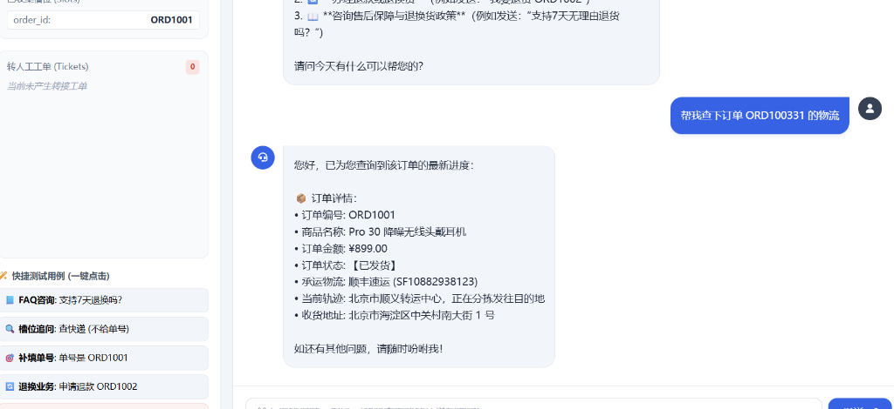
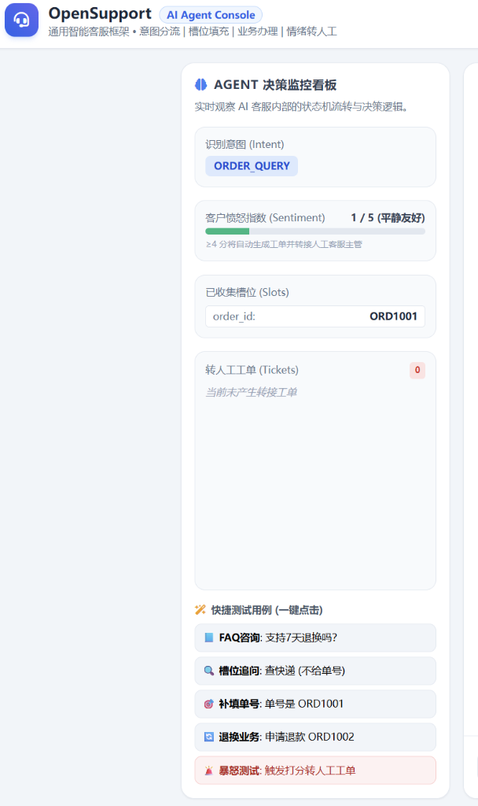
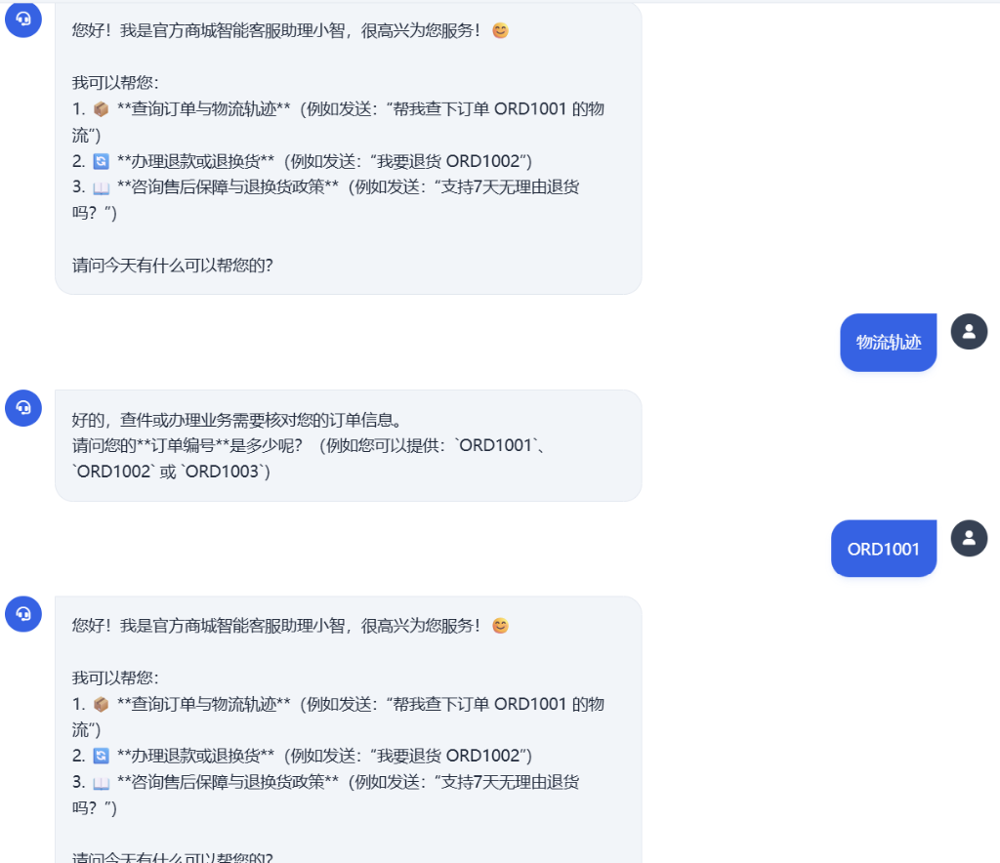

<div align="center">

# 🎧 OpenSupport

**现代化、生产就绪的智能客服 AI Agent 框架**  
*A Production-Ready Customer Service AI Agent Framework with Intent Routing, Slot Filling, Vector RAG & Human Escalation.*

[](https://opensource.org/licenses/MIT)
[](https://www.python.org/downloads/)
[](https://fastapi.tiangolo.com)
[](#-向量数据库检索体系)
[%20%7C%20DeepSeek%20%7C%20Ollama%20%7C%20Mock-success.svg)](#-大模型支持与免费方案)

[English](#-english-overview) | [简体中文](#-为什么设计-opensupport) | [系统架构](#-系统架构) | [向量检索](#-向量数据库检索体系) | [快速上手](#-快速上手)

</div>

---

## 📸 界面效果演示 (Showcase)

OpenSupport 采用极简全屏经典聊天窗口设计，同时内嵌 Agent 决策实时监控抽屉，业务人员与开发者均可直观掌握 Agent 的每一个推理与工具调用细节：

### 1. 经典全屏对话窗口
用户端呈现纯粹、清爽的即时通讯交互体验，支持快速提问气泡与流式交互：


### 2. 实时 Agent 决策监控面板 (Agent Inspector)
随时展开侧边监控抽屉，实时洞察意图分类、情绪愤怒表盘、槽位收集状态与后台业务工单：


### 3. 多轮主动槽位追问与订单纠错
当用户仅表达“物流轨迹”而未提供单号时，Agent 自动温和追问并补齐槽位；若用户输入错误单号，能自动纠错与重置上下文：


---

## 💡 为什么设计 OpenSupport？

许多开源的“AI 客服”项目往往只是一个简单的“Prompt 聊天套壳”，在真实复杂业务中面临诸多痛点：
* ❌ **无法主动追问**：用户说“查下我的快递”，大模型直接报错缺少参数，而不是主动询问“请问您的订单号是多少？”
* ❌ **缺少意图分流**：将常见政策答疑、业务办理（查单/退款）和客户投诉混在一段长 Prompt 中，容易产生幻觉或乱调工具。
* ❌ **缺乏情绪兜底**：遇到极度愤怒、扬言投诉消协的客户，仍然机械回复，导致客诉激化。
* ❌ **重型依赖与部署繁琐**：很多方案动辄依赖庞大的外部数据库或复杂的微服务，开发者难以本地快速调试与二次开发。

**OpenSupport 为解决真实业务而生。**  
它将 **意图路由分类**、**多轮状态机（槽位填充）**、**高维向量数据库检索（Vector RAG）**、**真实业务工具链** 和 **情绪风控转人工** 深度融合，且**零重型中间件依赖**。

---

## ✨ 核心特性

- 🎯 **意图识别分流 (Intent Routing)**：精准将用户提问分发至 FAQ 问答、业务办理、闲聊或人工转接。
- 🔄 **主动槽位填充状态机 (Slot-Filling State Machine)**：若缺少订单号或关键信息，Agent 主动温和追问，直到参数补齐后再调用工具；支持会话级错误纠偏。
- 🔍 **高维向量数据库检索 (Dense Vector RAG)**：内置轻量高效的 NumPy 向量引擎，支持智谱 `embedding-3` (2048维)、OpenAI 等稠密向量嵌入，并提供离线自适应降级方案。
- ⚖️ **工业级混合检索 (Hybrid Search)**：融合稠密向量语义近邻相似度与稀疏关键词词法匹配，兼顾语义泛化与专有名词精确匹配。
- 🛡️ **情绪监测与人工转接 (Human Escalation)**：动态计算用户愤怒值（1-5分）。遇到强烈投诉时自动安抚、生成结构化支持工单（Support Ticket）并切换转人工模式。
- 📦 **完整业务工具链**：内置模拟订单中心（`ORD1001`、`ORD1002`、`ORD1003`），支持订单状态查询、物流轨迹追踪、退货申请与地址变更。
- 🖥️ **全屏响应式 Web 工作台**：支持现代全屏布局与侧边抽屉式 Agent 决策监控面板。
- 🎁 **多模型自适应与零成本上手**：原生支持 **智谱 GLM-4-Flash（官方永久免费）**、**DeepSeek**、**本地离线 Ollama** 与内置 Mock 引擎。

---

## 🏗️ 系统架构

```mermaid
flowchart TD
    User([用户发送消息]) --> Guard[情绪与安全风控监测]
    
    subgraph Analysis [分析与路由阶段]
        Guard --> Sentiment{情绪是否激动 (>=4分)?}
        Sentiment -- 是 / 明确要求人工 --> Escalate[生成加急工单 & 转接人工客服]
        Sentiment -- 否 (情绪平稳) --> IntentRouter[意图分类器: FAQ / 业务 / 闲聊]
    end

    subgraph Business [业务处理与知识检索]
        IntentRouter -- 政策/常见问题 --> VectorRAG[向量数据库检索: Dense Vector + Hybrid Search]
        IntentRouter -- 查单/物流/退款 --> SlotCheck{必要槽位 (order_id) 是否齐全?}
        SlotCheck -- 缺失 --> SlotAsk[向用户主动追问订单编号]
        SlotCheck -- 齐全 --> ToolExec[执行业务工具: 查询/退款/修改地址]
        IntentRouter -- 问候/闲聊 --> Chitchat[友好问候与引导]
    end

    VectorRAG --> Response[整合业务数据与大模型输出最终回复]
    SlotAsk --> Response
    ToolExec --> Response
    Chitchat --> Response
    Escalate --> Response
    Response --> User
```

---

## 🔍 向量数据库检索体系

本项目除了基础的关键词检索外，完整实现了**稠密向量数据库检索（Dense Vector Retrieval）与混合检索（Hybrid RAG）**机制：

```
                              ┌─────────────────────────────────────────┐
                              │           用户自然语言输入               │
                              └──────────────────┬──────────────────────┘
                                                 │
                                                 ▼
                              ┌─────────────────────────────────────────┐
                              │  获取高维向量 Embedding (如 embedding-3) │
                              └─────────┬────────────────────┬──────────┘
                                        │                    │
                   Dense Vector (2048维) │                    │ 文本 Query
                                        ▼                    ▼
                ┌──────────────────────────────────┐ ┌──────────────────┐
                │     VectorStore (向量数据库)     │ │ LexicalRetriever │
                │   NumPy 余弦相似度矩阵计算       │ │   稀疏关键词匹配  │
                └─────────────────┬────────────────┘ └─────────┬────────┘
                                  │ 相似度得分 DenseScore       │ 词法命中 SparseScore
                                  │ (权重 alpha = 0.7)          │ (权重 1 - alpha = 0.3)
                                  └───────────────┬────────────┘
                                                  ▼
                                   ┌─────────────────────────────┐
                                   │  Hybrid Search 综合打分融合 │
                                   └──────────────┬──────────────┘
                                                  ▼
                                     Top-1 最优知识库问答条目
```

### 1. 核心实现类说明

| 类名 | 路径 | 核心能力与设计原理 |
| :--- | :--- | :--- |
| **`VectorStore`** | `opensupport/rag.py` | 本地向量数据库。采用 NumPy 矩阵批量点积计算 L2 归一化向量的余弦相似度（Cosine Similarity），支持向量与文档元数据持久化存储为 `data/vector_index.json`。 |
| **`VectorFAQRetriever`** | `opensupport/rag.py` | 知识检索协调器。负责自动将知识库条目构建向量索引，根据运行时环境自动适配大模型向量维度，提供纯向量检索 (`vector_search`) 与混合检索 (`hybrid_search`)。 |

### 2. 向量嵌入生成机制
* **云端高质量稠密向量**：支持调用智谱 AI `embedding-3` 模型生成 2048 维向量（或 OpenAI `text-embedding-3-small` 1536 维向量），语义捕获能力极强。
* **离线降级保障**：在无网络或未配置 API Key 的离线环境下，自动降级为局部敏感双字 N-Gram 语义特征嵌入（384 维稠密向量），保证系统 100% 可用。
* **维度自适应**：当切换不同 Embedding 引擎导致向量维度变化时，系统自动感知并触发动态全量重建索引，杜绝矩阵维度不匹配异常。

### 3. 独立使用向量检索代码示例

您可以直接脱离客服对话，在自己的脚本中调用向量数据库进行数据检索：

```python
from opensupport.rag import VectorFAQRetriever
from opensupport.config import get_llm_config

# 1. 初始化检索器（自动连接大模型 Embedding 或使用离线引擎）
cfg = get_llm_config()
retriever = VectorFAQRetriever(
    client=cfg.get("client"),
    embedding_model="embedding-3"
)

# 2. 纯向量近邻语义检索
doc = retriever.vector_search("买完东西不想要了怎么退", top_k=1, threshold=0.4)
if doc:
    print(f"匹配问题: {doc['question']}")
    print(f"解答内容: {doc['answer']}")

# 3. 工业级混合检索（向量语义 + 关键词重合度加权）
best_match = retriever.hybrid_search("保修期内坏了怎么处理", alpha=0.7)
print(f"最终采纳条目: {best_match['question']}")
```

---

## 🚀 快速上手

### 1. 克隆代码与安装依赖

```bash
git clone https://github.com/guan110110/OpenSupport.git
cd OpenSupport

# 安装依赖 (推荐 Python 3.10+)
pip install -r requirements.txt
```

### 2. 配置大模型（可选，开箱自带默认与离线引擎）

在项目根目录下创建 `.env` 文件（或修改已有的 `.env`）：

```bash
# 方案 A: 智谱清言 (推荐! 官方 GLM-4-Flash 永久免费，极速稳定)
ZHIPU_API_KEY=your_zhipu_api_key_here

# 方案 B: DeepSeek
# DEEPSEEK_API_KEY=your_deepseek_api_key_here

# 方案 C: 本地 Ollama (无需配置 Key，只要本地运行 ollama 即可自动发现)
```

> 💡 **提示**：若不填写任何 Key，系统会自动运行离线自适应 Mock 模式，所有业务逻辑与槽位状态机均可完整体验！

### 3. 启动全屏 Web 工作台

```bash
python webui/server.py
```
终端启动后，浏览器打开 **`http://127.0.0.1:8501`** 即可进入现代化智能客服工作台。

### 4. 启动命令行对话 (CLI)

```bash
python examples/cli_chat.py
```

---

## 🧪 经典测试用例

在 Web 界面或命令行中，可尝试输入以下典型用例观察 Agent 的反应：

| 业务场景 | 用户输入示例 | Agent 行为表现 |
| :--- | :--- | :--- |
| **政策咨询 (Vector RAG)** | *“支持7天无理由退货吗？”* | 通过稠密向量检索知识库，给出精准无理由退换规则及运费分摊标准。 |
| **泛化语义问答** | *“买的机器不想要了怎么退”* | 向量语义命中退换政策，无需出现完全一致的字面关键词。 |
| **槽位主动追问** | *“帮我查下我的快递到哪了”* | 意图识别为查物流，检测到缺失 `order_id`，主动追问单号。 |
| **多轮单号补全** | *“单号是 ORD1001”* | 识别上下文填入单号，调用真实物流接口返回“顺丰速运”轨迹。 |
| **错误单号纠偏** | *“我输入 错误的订单”* | 自动识别单号录入错误，重置槽位并友好提示用户重新输入正确单号。 |
| **退款业务办理** | *“我要申请退款，订单号是 ORD1002”* | 提取参数并执行退款工具，返回退款审核状态与退货寄件说明。 |
| **愤怒情绪转人工** | *“这什么破东西！再不处理我直接去打12315投诉！”* | 愤怒值打满 5 分，触发情绪安抚并自动创建紧急人工支持工单。 |

---

## 📁 项目目录结构

```
OpenSupport/
├── opensupport/               # 核心框架源码
│   ├── agent.py               # 客服 Agent 主流程调度中心
│   ├── config.py              # LLM 与环境配置（智谱/DeepSeek/Ollama/Mock）
│   ├── intent.py              # 意图识别与槽位提取器
│   ├── rag.py                 # 向量数据库 (VectorStore) 与混合检索器 (VectorFAQRetriever)
│   ├── session.py             # 会话上下文状态机 (DialogState) 与工单管理
│   ├── tools.py               # 业务工具库 (订单查询、物流轨迹、退款申请)
│   └── prompt.py              # 提示词工程模板
├── webui/                     # 现代 Web 工作台
│   └── server.py              # FastAPI 后端 + 原生全屏响应式前端
├── data/                      # 基础知识与模拟业务数据库
│   ├── faq.json               # 常见问题 FAQ 知识库
│   ├── orders.json            # 模拟电商订单数据
│   └── vector_index.json      # 持久化向量索引文件
├── docs/                      # 文档与截图资源
│   └── images/                # 界面效果截图
│       ├── chat_demo.png
│       ├── agent_monitor.png
│       └── slot_filling.png
├── examples/                  # 示例代码
│   └── cli_chat.py            # 终端交互脚本
├── tests/                     # 单元与集成测试用例
│   ├── test_service.py        # 业务对话、槽位与状态机测试
│   └── test_vector_rag.py     # 向量余弦检索与语义检索测试
├── requirements.txt           # 项目依赖清单
├── LICENSE                    # MIT 开源协议
└── README.md                  # 项目中英文使用说明
```

---

## 🌐 English Overview

**OpenSupport** is an enterprise-ready, open-source AI Customer Service Agent framework built with Python and FastAPI. Unlike naive chat wrappers, OpenSupport is engineered for real-world customer operations:

* **Intent Routing**: Automatically categorizes user queries into FAQ, Order Fulfillment, General Chitchat, or Human Handoff.
* **Proactive Slot Filling**: Stateful dialog management that gracefully prompts users for missing fields (such as `order_id`) across turns.
* **Dense Vector RAG & Hybrid Retrieval**: Built-in NumPy vector engine supporting Zhipu `embedding-3` (2048-dim), OpenAI, and offline semantic hashing, combined with lexical BM25-style keyword matching.
* **Sentiment Guardrails & Escalation**: Quantifies user frustration level (1-5 scale) and escalates urgent issues into structured human support tickets.
* **Full-screen Responsive Web UI**: Clean classic instant messaging interface with a slide-over agent thought inspection dashboard.

---

## 🤝 贡献与交流

欢迎提交 Issue 和 Pull Request！无论是一个新的意图识别策略、更多的电商接口适配，还是前端界面的优化，都十分期待您的参与。

## 📄 开源许可证

本项目采用 [MIT License](LICENSE) 开源协议。无论是学术研究还是商业集成，均可自由使用。
